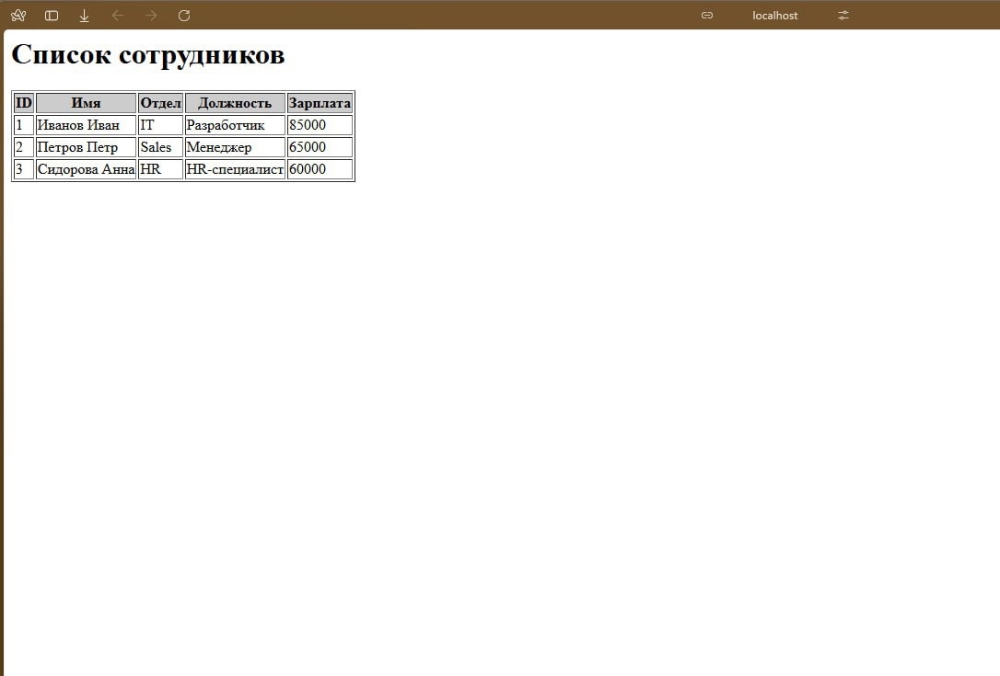

# Веб-приложение "Сотрудники" на Delphi + PostgreSQL

[](https://www.embarcadero.com/products/delphi)
[](https://www.postgresql.org/)
[](LICENSE)

## О проекте

Учебное веб-приложение, демонстрирующее архитектуру **клиент-сервер**:

- **Серверная часть** — Delphi 10.2 + WebBroker + Indy
- **Хранение данных** — PostgreSQL 18
- **Клиентская часть** — любой браузер (HTML-таблица)

>  **Важно:** на данный момент реализована только генерация статической HTML-страницы. Подключение к PostgreSQL выполняется в коде, но данные пока захардкожены для демонстрации.

## Быстрый старт

### 1. Требования

- Windows 10/11
- Embarcadero Delphi 10.2+ (с установленными компонентами FireDAC)
- PostgreSQL 18 (или 15+)
- Права администратора для открытия порта 8080

### 2. Установка и запуск

```bash
# Клонирование
git clone https://github.com/ВАШ_АККАУНТ/WebApp-Delphi-Employees.git
cd WebApp-Delphi-Employees

# Открыть в Delphi
start WebApp.dprojctive BOOLEAN DEFAULT TRUE
);
```
### 3. Настройка базы данных (PostgreSQL)
Запустите в pgAdmin или psql:

```  Создание базы
CREATE DATABASE company;

-- Подключитесь к базе \c company

-- Создание таблицы
CREATE TABLE employees (
    id SERIAL PRIMARY KEY,
    name VARCHAR(100) NOT NULL,
    department VARCHAR(50) NOT NULL,
    position VARCHAR(100) NOT NULL,
    salary DECIMAL(10,2) NOT NULL,
    hire_date DATE NOT NULL,
    email VARCHAR(100),
    is_active BOOLEAN DEFAULT TRUE
);

-- Тестовые данные
INSERT INTO employees (name, department, position, salary, hire_date, email) VALUES
('Иванов Иван', 'IT', 'Разработчик', 85000, '2023-01-15', 'ivanov@company.com'),
('Петров Петр', 'Sales', 'Менеджер', 65000, '2023-02-20', 'petrov@company.com'),
('Сидорова Анна', 'HR', 'HR-специалист', 60000, '2023-03-10', 'sidorova@company.com');

-- Создание пользователя для приложения
CREATE USER webapp_user WITH PASSWORD '123456';
GRANT SELECT ON employees TO webapp_user;
```

### 4. Настройка подключения в Delphi
В модуле WebModuleUnit1.pas укажите параметры подключения:

```
const
  DB_HOST = 'localhost';
  DB_PORT = 5432;
  DB_NAME = 'company';
  DB_USER = 'webapp_user';
  DB_PASS = '123456';
```
## Структура проекта
```
├── WebModuleUnit1.pas       # Обработчик HTTP-запросов (главный код)
├── WebModuleUnit1.dfm       # Визуальное представление веб-модуля
├── Project1.dpr             # Точка входа
├── database/
│   └── employees.sql        # SQL-скрипт для создания БД
├── README.md
└── SCREENSHOT.png           # Скриншот работающего приложения
```

### Скриншот



